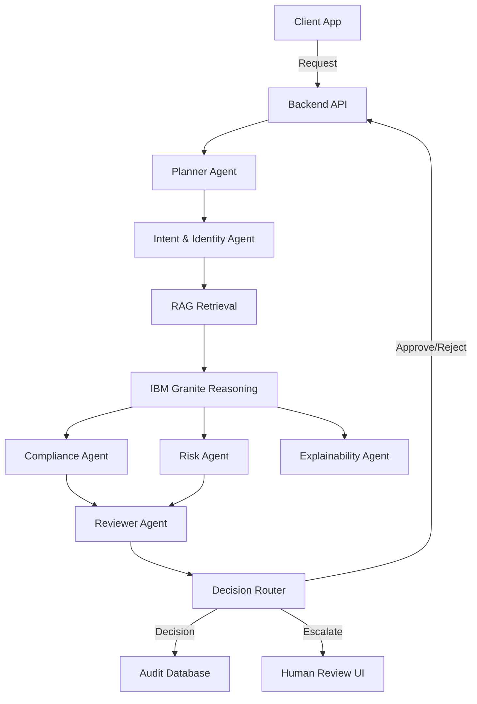

# AegisMesh AI — System Architecture

## High-Level Overview and Design Principles
AegisMesh AI provides an automated, agentic governance layer to validate and enforce data policies across AI and traditional workloads. 
Key design principles:
- **Agentic Orchestration**: Leverage single-purpose AI agents to assess distinct compliance and security requirements.
- **Fail Closed**: In case of component failure or uncertainty, default to rejecting requests or escalating to human review.
- **Traceability**: All decisions must be auditable with clear explainability trails.
- **Modular Integration**: Support pluggable LLM providers (e.g., IBM Granite) and configurable policy RAG systems.

## System Components
- **Frontend**: A React-based web interface for managing policies, reviewing escalations, and viewing audit logs.
- **Backend API**: FastAPI/Node.js based API layer handling incoming requests and serving the frontend.
- **Agent Orchestration**: A framework for coordinating the flow of requests through various specialized agents (Planner, Intent, Compliance, Risk, etc.).
- **RAG Layer**: Retrieval-Augmented Generation subsystem to fetch relevant policy documents for compliance assessment.
- **IBM Granite**: The core LLM engine providing reasoning, classification, and explainability capabilities.
- **Audit Database**: Persistent storage (e.g., PostgreSQL) for request states, evidence, agent reasoning, and final decisions.

## Data Flow Diagram

## The Governance Pipeline
1. **Request**: Incoming request containing user context, target data, and proposed action.
2. **Planner**: Validates request structure and plans the agent execution flow.
3. **Intent + Identity**: Analyzes the true intent of the request and verifies the identity/role of the requester.
4. **RAG Retrieval**: Fetches applicable company policies and regulations based on intent and target data.
5. **Granite Reasoning**: Analyzes the request against retrieved policies.
6. **Compliance + Risk + Explainability**: Specialized agents evaluate compliance, score risk, and generate plain-text explanations.
7. **Reviewer**: Consolidates findings and issues a preliminary decision.
8. **Decision Router**: Finalizes the decision (APPROVE, REJECT, MODIFY, ESCALATE) based on reviewer output.
9. **Audit**: Logs the entire trace immutably.

## Security Model
- **Zero Trust**: Every request is verified independently; no implicit trust based on network origin.
- **Data Minimization**: Only necessary data fields are passed to LLMs. Sensitive data is redacted or tokenized before LLM processing.
- **Immutable Auditing**: Audit logs are tamper-evident and append-only.

## Failure Handling Strategy
AegisMesh AI adheres to a strict **fail closed** model. If the RAG layer fails, Granite is unavailable, or an agent times out, the system automatically transitions the request to a `REJECT` or `ESCALATE` state. 

## Scalability Considerations
- **Stateless Agents**: Agents do not hold state between requests, allowing easy horizontal scaling.
- **Asynchronous Processing**: Long-running evaluations (like complex RAG + Granite reasoning) are handled asynchronously with webhook callbacks or polling.
- **Caching**: Policy retrieval results can be cached for high-frequency request types to reduce latency.
